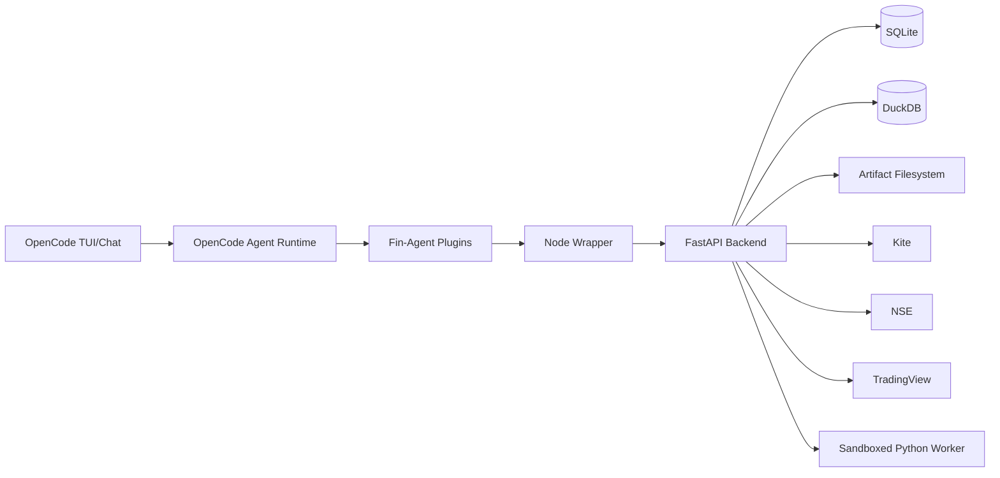

# Fin-Agent Technical Design (Stage 1)

## 1. Purpose

This is the engineering design spec for Fin-Agent Stage 1.

It covers:

1. Runtime architecture.
2. Component boundaries.
3. API and storage models.
4. Security/observability contracts.
5. Deployment and verification model.

## 2. Architectural Principle

Fin-Agent is an OpenCode-based agent wrapper:

1. OpenCode runtime handles chat/agent lifecycle.
2. Fin-Agent tools and API handle all finance logic.
3. Agent execution is tool-first and event-driven.

## 3. System Topology

## 4. Codebase Modules

### 4.1 OpenCode Layer

1. `.opencode/opencode.jsonc` plugin registration.
2. `.opencode/plugins/finagent-orchestrator.ts` orchestration hooks.
3. `.opencode/tools/finagent-tools.ts` tool definitions + API mapping.

### 4.2 Wrapper Layer

1. `apps/fin-agent/src/index.mjs`
2. Proxies `/health` and `/v1/*`.

### 4.3 Backend Layer

1. `py/fin_agent/api/app.py` API service.
2. Domain modules:
   - `integrations/`
   - `screener/`
   - `backtest/`
   - `strategy/`
   - `world_state/`
   - `analysis/`
   - `code_strategy/`
   - `tax/`
   - `storage/`
   - `security/`

## 5. API Boundary

Single service boundary: FastAPI (`/v1/*`).

Major endpoint groups:

1. Auth/connectors.
2. Provider data.
3. Data ingestion/transforms.
4. Strategy intake/spec and versioning.
5. World state + preflight.
6. Backtest/tuning/analysis.
7. Visualization/live lifecycle.
8. Context/session persistence.
9. Diagnostics/observability/audit.

## 6. Data Model

### 6.1 SQLite (Control Plane)

Persistent entities include:

1. Intent snapshots.
2. Strategy versions.
3. Backtest run metadata.
4. Jobs + job events.
5. Audit events.
6. OAuth states.
7. Connector sessions.
8. Live states + insights.
9. Tax reports.
10. Tool context deltas.
11. Session snapshots.
12. Kite candle cache metadata.

### 6.2 DuckDB (Analytics Plane)

Tables include:

1. `market_ohlcv`
2. `market_technicals`
3. `market_instruments`
4. `market_quotes`
5. `company_fundamentals`
6. `corporate_actions`
7. `analyst_ratings`

### 6.3 Artifact Store

Filesystem-backed artifacts:

1. Equity/drawdown charts.
2. Blotter/signal CSVs.
3. Boundary charts.

## 7. Execution Flows

### 7.1 Intent -> Strategy

1. Agent proposes or collects constraints.
2. Intent persisted.
3. Strategy spec generated + versioned.

### 7.2 World State + Backtest

1. Preflight enforces budget constraints.
2. PIT manifest built.
3. Backtest executes deterministically.
4. Metrics + artifacts persisted.

### 7.3 Tuning + Deep Dive

1. Search-space derivation.
2. Budgeted tuning execution.
3. Comparative analytics.
4. Explainable suggestions.

### 7.4 Live Insights

1. Activate strategy version.
2. Generate insight snapshots.
3. Feed and boundary candidate endpoints.

## 8. Screener Engine

### 8.1 Formula Safety

AST-based validation/compilation (`screener/formula.py`) with strict allowed identifier/operator set.

### 8.2 Runtime Derivations

`run_formula_screen` supports derived columns:

1. `sma_gap_pct`
2. `day_range_pct`
3. `return_1d_pct`

Ranking controls:

1. `rank_by`
2. `sort_order`

## 9. Provider Layer

### 9.1 Integrations

1. Kite (profile/holdings/instruments/candles/quotes/oauth).
2. NSE quote endpoint.
3. TradingView scan endpoint.

### 9.2 Rate-Limit Enforcement

`integrations/rate_limit.py` enforces provider window quotas.

Violation behavior:

1. HTTP 429.
2. explicit `provider_rate_limited` code.
3. retry hint in response.

### 9.3 Kite Candle Cache Path

API supports `use_cache` and `force_refresh`.

Returns:

1. `cache_hit` boolean.
2. `cache_key`.
3. `dataset_hash`.

## 10. Tax Overlay Engine

Module: `py/fin_agent/tax/india.py`

Supports:

1. STCG/LTCG rates.
2. LTCG exemption amount.
3. Cess toggle/rate.
4. Optional charge inclusion.
5. Detailed tax breakdown + post-tax metrics.

Endpoint: `/v1/backtests/tax/report`.

## 11. Context and Memory Durability

### 11.1 Stored Context

1. Per-tool deltas.
2. Session snapshots.
3. Latest rehydrate payload.
4. Snapshot diff endpoint.

### 11.2 Compaction Hook Integration

Orchestrator plugin uses OpenCode compaction hook to persist summary state.

## 12. Security Design

### 12.1 Secret Hygiene

1. Redaction helper masks sensitive keys in logs/events.
2. Connector sessions optionally encrypted with Fernet key (`FIN_AGENT_ENCRYPTION_KEY`).

### 12.2 Fail-Fast Contract

No hidden fallback paths for core failures.

Invalid states return explicit errors with remediation context.

## 13. Observability Design

### 13.1 Structured Logging

Middleware emits:

1. `request.start`
2. `request.end`
3. `request.error`

### 13.2 Audit and Metrics

1. Audit ledger in SQLite.
2. `/v1/observability/metrics`
3. `/v1/providers/health`
4. `/v1/diagnostics/readiness`

## 14. Operations and Shipping

### 14.1 Install and Readiness

1. `scripts/install-linux.sh`
2. `scripts/gen-encryption-key.sh --write`
3. `scripts/doctor.sh`

### 14.2 Runtime

1. `scripts/start-all.sh`
2. OpenCode server via `scripts/opencode-serve.sh`

### 14.3 Release Artifact

1. `scripts/release-tui.sh --version <tag>`

### 14.4 Deterministic System Smoke

1. `scripts/e2e-smoke.sh`

## 15. Quality and Verification

Current verification model:

1. Full automated Python test suite.
2. Wrapper/API E2E tests.
3. Operator script tests.
4. Manual runtime smoke and readiness checks.

## 16. Design Constraints

1. Stage-1 excludes news/social inference stack.
2. Stage-1 excludes order-routing execution.
3. Core architecture remains single orchestrator agent by default.

## 17. Future Extension Points

1. Stage-2 data providers (news/social/macro).
2. Richer multi-agent orchestration plans.
3. Extended portfolio/risk engines.
4. CI release workflow automation.

## 18. Technical Summary

Fin-Agent Stage 1 is a production-hardened OpenCode wrapper system with:

1. strict API boundaries,
2. deterministic local storage/compute,
3. tool-first agent orchestration,
4. explicit diagnostics and fail-fast behavior,
5. reproducible deploy/smoke/release paths.
