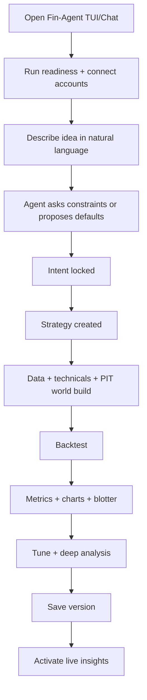

# Fin-Agent User Design (Stage 1)

## 1. Purpose

This document explains Fin-Agent from the user perspective:

1. What it is.
2. How you use it end to end.
3. What outcomes you should expect.
4. What is included in Stage 1.

## 2. What Fin-Agent Is

Fin-Agent is a chat-first trading research copilot.

You describe an idea in natural language, and the agent drives tools in the background to:

1. Build strategy logic.
2. Validate data/time windows.
3. Run backtests.
4. Show metrics, charts, and analysis.
5. Save versions and provide live insight feeds.

## 3. Who It Is For

1. Traders who want strategy iteration through chat.
2. Quants who want deterministic local backtesting.
3. Users who need explainable output before acting.

## 4. Stage-1 Scope (What You Get Today)

1. OHLCV and technical-indicator workflows.
2. Fundamentals, corporate actions, ratings ingestion.
3. Point-in-time (time-travel) historical simulation.
4. Strategy creation + versioning.
5. Backtesting + comparison + deep analysis.
6. Tax-adjusted post-backtest overlay.
7. Saved sessions and persistent strategy context.
8. Live insight feed (buy/sell style signals, non-ordering).
9. Custom Python strategy lane with sandbox + analysis.

Not in Stage 1:

1. News/social sentiment fusion.
2. Full broker auto-order execution.

## 5. User Journey End to End



## 6. Interaction Model

### 6.1 Chat First

You primarily interact through chat.

### 6.2 Agent-Decides Option

If you do not provide all parameters, the agent can propose defaults and show a decision card.

You can:

1. Accept all.
2. Edit specific fields.
3. Re-run with adjusted constraints.

### 6.3 Human Review Gate

You remain in control:

1. Backtest outputs are shown before activation.
2. Suggestions are explicit.
3. Saved versions preserve traceability.

## 7. Key User Inputs

Typical parameters the agent will ask for or infer:

1. Universe (symbols/index basket).
2. Timeframe (intraday/swing/long term).
3. Backtest window (start/end).
4. Capital and max positions.
5. Signal thresholds / windows.
6. Risk preference.

## 8. What You See After Backtest

1. Core metrics (Sharpe, CAGR, drawdown, etc.).
2. Equity and drawdown charts.
3. Trade blotter and signal reasons.
4. Strategy-level explanation and risks.
5. Improvement suggestions.
6. Optional tax-adjusted report.

## 9. Save, Resume, Iterate

You can:

1. Save strategy versions anytime.
2. Return later and rehydrate session context.
3. Compare versions/runs.
4. Continue iterative tuning.

## 10. Live Insight Experience

After activation, the system maintains a live-style insight feed based on current strategy logic.

You can:

1. Activate.
2. Pause.
3. Stop.
4. Inspect boundary-near opportunities.

## 11. Custom Python Strategy Experience

Advanced users can paste strategy code.

Flow:

1. Validate code contract.
2. Run sandbox check.
3. Backtest with your code.
4. Request analysis/patch suggestions.

## 12. Setup Experience

### 12.1 First-Time Setup

```bash
cp .env.example .env.local
./scripts/install-linux.sh
./scripts/gen-encryption-key.sh --write
./scripts/doctor.sh
./scripts/start-all.sh
```

### 12.2 Optional End-to-End Smoke

```bash
./scripts/e2e-smoke.sh
```

### 12.3 Release Packaging

```bash
./scripts/release-tui.sh --version 0.1.0
```

## 13. Account Connectivity

### 13.1 OpenAI / OpenCode Auth

Either of:

1. OpenCode OAuth (`opencode auth login openai`), or
2. `OPENAI_API_KEY` in `.env.local`.

### 13.2 Kite

Use:

1. `/v1/auth/kite/connect`
2. Login in browser.
3. Callback completes.
4. Verify with `/v1/auth/kite/status`.

## 14. Reliability and Safety (User View)

Fin-Agent is designed to fail explicitly, not silently.

If something is wrong, you get:

1. Clear error code/detail.
2. Remediation guidance.
3. Observable diagnostics endpoints.

No fake fallback data is injected.

## 15. Operational Commands (User-Friendly)

1. Health: `GET /health`
2. Readiness: `GET /v1/diagnostics/readiness`
3. Provider health: `GET /v1/providers/health`
4. Metrics: `GET /v1/observability/metrics`

## 16. Stage-1 Success Criteria for Users

The product is “working” when you can:

1. Chat an idea -> get strategy spec.
2. Build/validate world state.
3. Run backtest and inspect results.
4. Tune and compare variants.
5. Save and reactivate strategy context.
6. Use live insight feed.

## 17. Limits You Should Know

1. It is not an auto-execution broker in Stage 1.
2. News/social inference is not yet active in Stage 1.
3. Data provider quality/latency depends on external APIs.

## 18. Bottom Line

From a user standpoint, Fin-Agent Stage 1 is a complete chat-based strategy research and iteration app with:

1. Deterministic backtesting.
2. Explainable outputs.
3. Persistent strategy memory.
4. Production-level operational checks.
