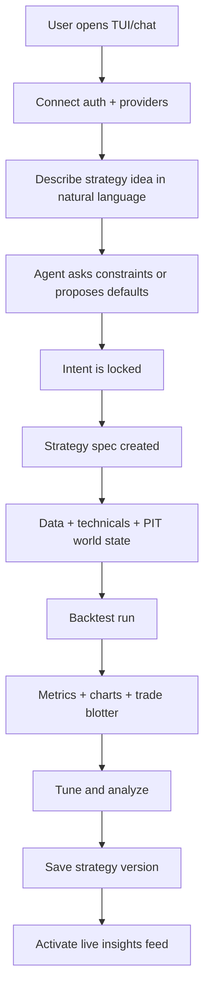
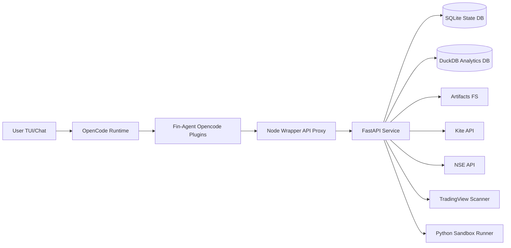
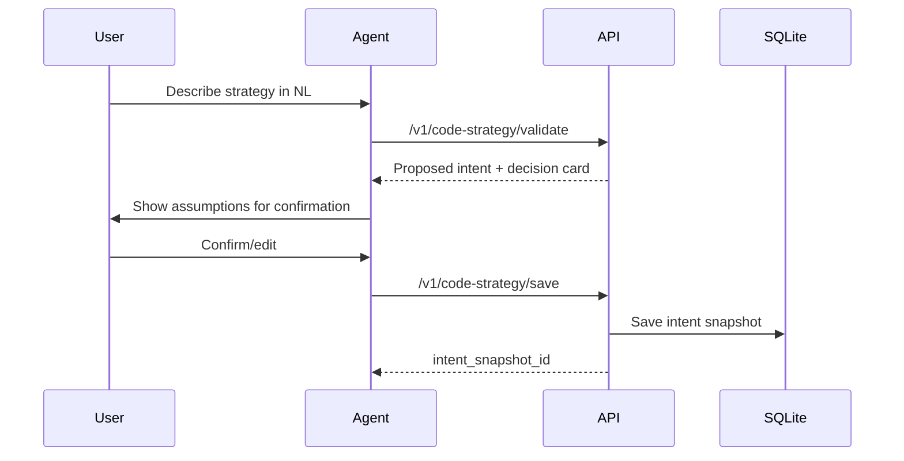
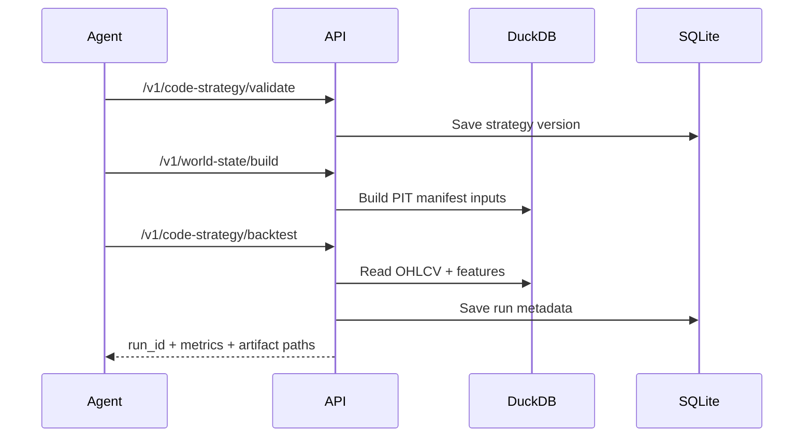

# Fin-Agent End-to-End Design

## 1. Document Purpose

This document explains the **complete working design** of Fin-Agent Stage 1 from:

1. User side: what a user does, sees, and expects.
2. Technical side: how each part of the system is structured and executed.

It is written as an implementation-backed design, aligned to the current codebase and runtime behavior.

## 2. Product Summary

Fin-Agent is a **chat-first, agent-centric trading copilot** built as a wrapper over OpenCode runtime:

1. OpenCode provides the chat/agent execution base.
2. Fin-Agent provides finance tools, APIs, data pipelines, backtesting, analytics, and persistence.

The operating model is:

1. User expresses intent in natural language.
2. Agent orchestrates tool calls.
3. Tools perform deterministic data and strategy operations.
4. Results come back with explainable metrics/artifacts.

## 3. Stage-1 Scope

Stage 1 focuses on deterministic, structured data and strategy lifecycle:

1. OHLCV import and indicator computation.
2. Fundamentals, corporate actions, ratings ingestion.
3. PIT world-state validation and backtesting.
4. Strategy building, tuning, deep analysis.
5. Visual artifacts (equity/drawdown/blotter/boundary).
6. Live insight activation (non-ordering signal feed).
7. Custom Python strategy sandbox lane.
8. Kite/NSE/TradingView provider integration.
9. Tax overlay for post-backtest reporting.
10. Persistent context/memory and observability.

Out of Stage-1:

1. Auto order execution.
2. Full sentiment/news social pipelines (Stage 2).
3. Autonomous hedge-fund style multi-agent planner by default.

## 4. User Personas and User-Side Experience

### 4.1 Primary User

A discretionary or systematic retail trader/researcher who wants:

1. Natural-language strategy iteration.
2. Data-backed, reproducible backtests.
3. Strong explainability and risk metrics.
4. Saved strategies and reusable sessions.

### 4.2 User Mental Model

The product behaves like:

1. A chat agent for strategy development.
2. A finance toolchain behind the chat.
3. A persistent local research workstation.

### 4.3 User Journey (Happy Path)



### 4.4 User Controls

The user can:

1. Choose universe/timeframe/capital/risk knobs.
2. Ask agent to propose assisted defaults when acceptable.
3. Confirm/reject decision cards.
4. Trigger backtest, compare runs, tune, analyze.
5. Save/edit/re-run strategies.
6. Use custom Python strategy code and ask for patch suggestions.

## 5. System Architecture Overview

### 5.1 High-Level Components



### 5.2 Core Principle

OpenCode handles agent runtime; Fin-Agent handles finance execution. The agent does not compute finance logic directly; it orchestrates tools.

## 6. Repository Structure

```text
.
├── .opencode/
│   ├── opencode.jsonc
│   ├── plugins/
│   │   └── finagent-orchestrator.ts
│   ├── tools/
│   │   └── finagent-tools.ts
│   └── commands/
├── apps/
│   └── fin-agent/
│       └── src/index.mjs
├── py/
│   ├── fin_agent/
│   │   ├── api/app.py
│   │   ├── integrations/
│   │   ├── backtest/
│   │   ├── screener/
│   │   ├── tax/
│   │   ├── storage/
│   │   ├── strategy/
│   │   ├── analysis/
│   │   ├── world_state/
│   │   ├── code_strategy/
│   │   └── ...
│   └── tests/
├── scripts/
│   ├── serve.sh
│   ├── start-all.sh
│   ├── doctor.sh
│   ├── install-linux.sh
│   ├── release-tui.sh
│   ├── gen-encryption-key.sh
│   └── e2e-smoke.sh
└── docs/
```

## 7. Runtime and Process Topology

### 7.1 Services

1. FastAPI server (`py/fin_agent/api/app.py`) on port `8080`.
2. Node wrapper (`apps/fin-agent/src/index.mjs`) on port `8090` by default.
3. OpenCode server as chat runtime (separate process).

### 7.2 Wrapper Role

The wrapper forwards `/health` and `/v1/*` requests to FastAPI while preserving method/body/status.

## 8. Agent and Plugin Design

### 8.1 OpenCode Plugin Registration

Project-level plugin registration is in:

1. `.opencode/opencode.jsonc`

Registered local plugins:

1. `./plugins/finagent-orchestrator.ts`
2. `./tools/finagent-tools.ts`

### 8.2 Plugin Responsibilities

1. `finagent-orchestrator.ts`:
   - Compaction hook context injection.
   - Session snapshot persistence on compaction.

2. `finagent-tools.ts`:
   - Defines finance tools exposed to OpenCode.
   - Maps tool calls to API endpoints.
   - Records context deltas via `/v1/context/delta`.

### 8.3 Tool-First Execution Contract

Agent should call tools for actionable work:

1. Data operations.
2. Strategy operations.
3. Backtest and tuning.
4. Visualization.
5. Session recovery and diagnostics.

## 9. API Design Surface

Main API lives in `py/fin_agent/api/app.py`.

### 9.1 Auth + Connectivity

1. `GET /v1/auth/kite/connect`
2. `GET /v1/auth/kite/callback`
3. `GET /v1/auth/kite/status`
4. `GET /v1/auth/opencode/openai/oauth/status`
5. `GET /v1/auth/opencode/openai/oauth/connect`

### 9.2 Provider Data

1. `GET /v1/kite/profile`
2. `GET /v1/kite/holdings`
3. `POST /v1/kite/instruments/sync`
4. `POST /v1/kite/candles/fetch`
5. `POST /v1/kite/quotes/fetch`
6. `POST /v1/nse/quote`
7. `POST /v1/tradingview/screener/run`

### 9.3 Data + Strategy Core

1. `POST /v1/data/import`
2. `POST /v1/data/import/fundamentals`
3. `POST /v1/data/import/corporate-actions`
4. `POST /v1/data/import/ratings`
5. `POST /v1/data/fundamentals/as-of`
6. `POST /v1/data/technicals/compute`
7. `POST /v1/universe/resolve`

### 9.4 Strategy Intake + Strategy

1. `POST /v1/code-strategy/validate`
2. `POST /v1/code-strategy/save`
3. `GET /v1/code-strategies`
4. `GET /v1/code-strategies/{strategy_id}/versions`
5. `POST /v1/code-strategy/run-sandbox`
6. `POST /v1/code-strategy/backtest`
7. `POST /v1/code-strategy/analyze`

### 9.5 World State and Preflight

1. `POST /v1/world-state/build`
2. `POST /v1/world-state/completeness`
3. `POST /v1/world-state/validate-pit`
4. `POST /v1/preflight/world-state`
5. `POST /v1/preflight/custom-code`

### 9.6 Backtest + Analysis + Live

1. `GET /v1/backtests/runs`
2. `GET /v1/backtests/runs/{run_id}`
3. `POST /v1/backtests/compare`
4. `POST /v1/backtests/tax/report`
5. `POST /v1/visualize/trade-blotter`
6. `POST /v1/visualize/boundary`
7. `GET /v1/tuning/runs`
8. `GET /v1/tuning/runs/{tuning_run_id}`
9. `POST /v1/live/activate`
10. `POST /v1/live/pause`
11. `POST /v1/live/stop`
12. `GET /v1/live/states`
13. `GET /v1/live/states/{strategy_version_id}`
14. `GET /v1/live/feed`
15. `GET /v1/live/boundary-candidates`

### 9.7 Context + Observability + Operations

1. `POST /v1/context/delta`
2. `POST /v1/session/snapshot`
3. `POST /v1/session/rehydrate`
4. `GET /v1/session/diff`
5. `GET /v1/providers/health`
6. `GET /v1/observability/metrics`
7. `GET /v1/diagnostics/readiness`
8. `GET /v1/audit/events`
9. `GET /v1/events/jobs`
10. `GET /v1/artifacts`
11. `GET /v1/artifacts/file`

## 10. Data Storage Design

### 10.1 SQLite (Control Plane)

Used for:

1. Intent snapshots.
2. Strategy versions and backtest runs metadata.
3. Jobs and job events.
4. Audit events.
5. OAuth states and connector sessions.
6. Live state + insights.
7. Tax reports.
8. Tool context deltas.
9. Session snapshots.
10. Kite candle cache metadata.

### 10.2 DuckDB (Analytics Plane)

Used for:

1. `market_ohlcv`
2. `market_technicals`
3. `market_instruments`
4. `market_quotes`
5. `company_fundamentals`
6. `corporate_actions`
7. `analyst_ratings`

### 10.3 Artifacts

Filesystem artifacts include:

1. Equity curves.
2. Drawdown plots.
3. Trade blotter CSV.
4. Signal context CSV.
5. Boundary charts.

## 11. Key Functional Flows

### 11.1 Strategy Intake to Locked Spec



### 11.2 Strategy Build and Backtest



### 11.3 Tuning and Deep Analysis
1. Agent inspects historical run history via `/v1/backtests/runs`.
2. Agent lists prior tuning diagnostics via `/v1/tuning/runs` and `/v1/tuning/runs/{id}`.
3. Agent uses existing run + world-state artifacts to propose explainable refinements.
4. User accepts refinements and applies via agent-driven code-strategy updates.

### 11.4 Live Insight Lifecycle

1. Agent/user activates with `/v1/live/activate`.
2. System records insights into live tables.
3. Feed consumed through `/v1/live/feed`.
4. Boundary candidates exposed by `/v1/live/boundary-candidates`.
5. Pause/stop supported.

## 12. Custom Python Strategy Lane

### 12.1 Design Goals

1. Enable advanced users to provide Python strategy logic.
2. Keep execution constrained and observable.
3. Return deterministic outputs and analysis suggestions.

### 12.2 API Path

1. Validate source: `/v1/code-strategy/validate`
2. Save version: `/v1/code-strategy/save`
3. Sandbox run: `/v1/code-strategy/run-sandbox`
4. Backtest: `/v1/code-strategy/backtest`
5. Analysis: `/v1/code-strategy/analyze`

### 12.3 Safety

The API enforces:

1. Timeout bounds.
2. Memory bounds.
3. CPU seconds bounds.
4. Explicit failure on invalid code contract.

## 13. PIT and Data Quality Design

### 13.1 Point-in-Time Discipline

Data queries are constrained by timestamp/as-of to avoid lookahead leakage.

### 13.2 Required Timestamp Contracts

1. Fundamentals require `published_at`.
2. Corporate actions require `effective_at`.
3. Ratings require `revised_at`.

Missing required fields produce explicit failure.

### 13.3 Completeness and Validation

1. `world-state/completeness` provides explicit quality report.
2. `world-state/validate-pit` enforces strict leakage checks.

## 14. Screener Design

### 14.1 Formula Compiler

Safe AST parser (`py/fin_agent/screener/formula.py`) compiles a restricted formula grammar into SQL-compatible expression.

### 14.2 Screener Runtime

`py/fin_agent/screener/service.py` builds latest snapshot rows and derived metrics:

1. `sma_gap_pct`
2. `day_range_pct`
3. `return_1d_pct`

Supports ranking controls:

1. `rank_by`
2. `sort_order`

## 15. Provider Integration and Rate Limits

### 15.1 Providers

1. Kite for auth/account/candles/quotes/instruments.
2. NSE for quote endpoint.
3. TradingView scanner (session-cookie based).

### 15.2 Rate-Limit Design

`py/fin_agent/integrations/rate_limit.py` enforces per-provider request windows.

On limit breach:

1. API returns `429`.
2. Includes remediation and `retry_after_seconds`.
3. No silent fallback.

### 15.3 Candle Cache Metadata

Kite candle requests can use cache metadata path (`use_cache` and `force_refresh`) and return `cache_hit` status to the caller.

## 16. Tax Overlay Design

Tax overlay endpoint: `/v1/backtests/tax/report`

Features:

1. STCG and LTCG rates.
2. LTCG exemption amount.
3. Cess toggle/rate.
4. Charges inclusion toggle.
5. Post-tax net profit with breakdown.

All reports persist in SQLite for reproducibility.

## 17. Context and Memory Management

### 17.1 Persistent Context Artifacts

1. Tool-level context deltas (`/v1/context/delta`).
2. Session snapshots (`/v1/session/snapshot`).
3. Session rehydrate (`/v1/session/rehydrate`).
4. Session diff (`/v1/session/diff`) for state evolution debugging.

### 17.2 Compaction Hook

OpenCode compaction hook writes a session snapshot so context survives long interactions.

## 18. Security Design

### 18.1 Secret Protection

1. Redaction of sensitive fields in logs/audit.
2. Optional encryption at rest for connector session payloads via `FIN_AGENT_ENCRYPTION_KEY`.

### 18.2 Failure Contract

System fails fast with explicit diagnostics for:

1. Missing required creds.
2. Invalid OAuth state.
3. Provider/network errors.
4. Invalid schemas/formulas/code contracts.

No fake defaults or hidden recovery path.

## 19. Observability Design

### 19.1 Structured Request Logs

Middleware writes:

1. `request.start`
2. `request.end` (with duration)
3. `request.error`

Each with trace correlation.

### 19.2 Audit Ledger

Business events are stored with payload redaction in SQLite audit table.

### 19.3 Operational Endpoints

1. `/v1/providers/health`
2. `/v1/observability/metrics`
3. `/v1/diagnostics/readiness`

## 20. Deployment and Publish Design

### 20.1 Install + Readiness

1. `./scripts/install-linux.sh`
2. `./scripts/gen-encryption-key.sh --write`
3. `./scripts/doctor.sh`

### 20.2 Start Stack

1. `./scripts/start-all.sh`
2. OpenCode server separately via `./scripts/opencode-serve.sh`

### 20.3 Release Packaging

1. `./scripts/release-tui.sh --version <tag>`

Generates tarball + sha256 manifest.

### 20.4 End-to-End Smoke

1. `./scripts/e2e-smoke.sh`

Validates API + wrapper + strategy pipeline primitives.

## 21. Testing Strategy

### 21.1 Automated Suite

Python unit/integration suite currently validates core and hardening paths, including:

1. API flows.
2. Auth flows.
3. Screener and provider operations.
4. Tax overlay.
5. Session durability.
6. Wrapper E2E.
7. Visual artifacts.
8. Operator scripts.

Current baseline in repo: full suite passing.

### 21.2 Manual Verification

1. `doctor` gate.
2. `e2e-smoke` run.
3. OpenCode plugin load via `opencode debug config`.

## 22. User-Facing Command Cookbook

Minimal operator sequence:

```bash
cp .env.example .env.local
./scripts/install-linux.sh
./scripts/gen-encryption-key.sh --write
./scripts/doctor.sh
./scripts/start-all.sh
./scripts/e2e-smoke.sh
```

Kite auth sequence:

```bash
curl -sS http://127.0.0.1:8080/v1/auth/kite/connect
# open connect_url, login, callback completes
curl -sS http://127.0.0.1:8080/v1/auth/kite/status
```

## 23. Non-Goals and Known Boundaries

1. This is not an execution broker/order router.
2. This is not a full macro+news+social inference stack yet.
3. It relies on external provider connectivity and their data quality.
4. Default architecture is single orchestrator agent with tool-first execution.

## 24. Future Stage-2 Direction (Planned)

1. Add curated news/social/macro data pipelines.
2. Add event-annotated backtests with narrative context.
3. Expand multi-agent decomposition for larger workloads.
4. Add richer portfolio/risk overlays.

## 25. Final Design Statement

Fin-Agent Stage 1 is designed as a **production-hardened, chat-first, tool-orchestrated research and strategy system**:

1. Agent-centric user interaction.
2. Deterministic, test-backed compute layer.
3. Local-first persistence and artifact lineage.
4. Explicit safety/diagnostics/fail-fast behavior.
5. Deployable as a TUI wrapper stack over OpenCode runtime.
