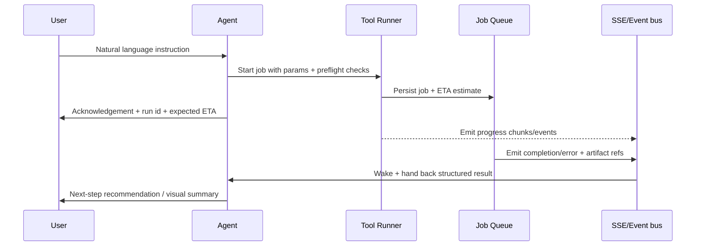
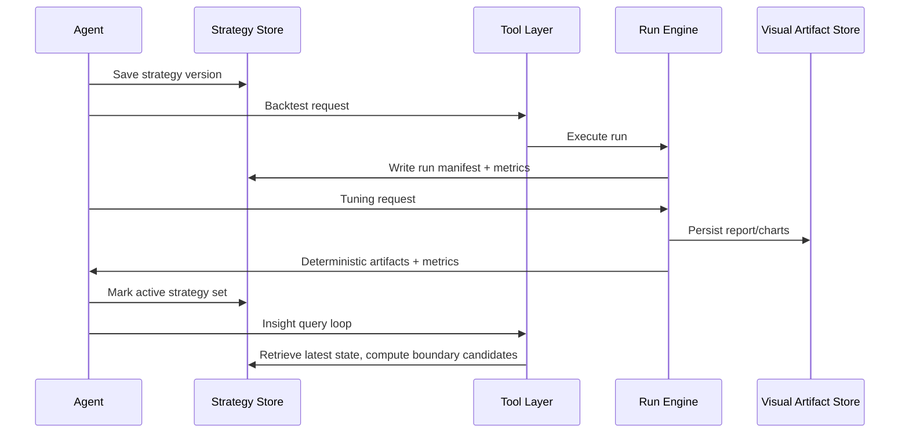

# Fin-Agent Stage 1 Design Document

## 1) Purpose and Scope

This document defines the complete Stage 1 end-to-end design for `Fin-Agent` as a chat-first, agent-centric finance copilot built on top of OpenCode server mode with local-first storage and explicit tool orchestration.

### What this version guarantees
- Chat-first user experience as primary interaction mode.
- Single orchestrator agent as default.
- All non-core actions are tools/commands/skills executed via explicit tool calls.
- Deterministic strategy lifecycle: strategy intake -> spec -> backtest -> analyze -> save/edit -> activate insights.
- Time-travel (Point-in-Time) simulation for historical backtests.
- Local persistence of all state and artifacts.
- Event-driven execution where long-running tools hand control back to the agent when completed.
- Stage 2 integrations (news/social/macro) are out of scope.

## 2) Non-Negotiables and Constraints

- No fake data.
- No silent fallbacks.
- No random defaults when data or assumptions are missing.
- Any fallback must include explicit `fallback_reason` and be surfaced to user/agent.
- Fail fast on critical violations.
- Reproducibility and explainability required by default.
- Custom code execution must be sandboxed.
- No Docker dependency for code execution by default.
- No separate NLP intent-parser service in Stage 1; agent orchestration is the intent/runtime layer.
- No keyword/regex-first reasoning path for strategy decisions.

## 3) Current Phase in Scope

### Stage 1 In Scope
- OHLCV/technicals
- Fundamentals and financials
- Corporate actions
- Ratings/events with as-of timing constraints
- User-defined trading intentions
- Strategy creation/backtesting/tuning with explainable outputs
- Custom Python strategy lane
- Multi-metric benchmark reporting: Sharpe, CAGR, max drawdown, etc.
- Human-review explanations
- Activate/deactivate insights and boundary-near recommendations
- Save and restore strategy versions
- Kite/Zerodha and OpenCode-native Codex/OpenAI OAuth connectivity (no Fin-Agent-managed external OpenAI key flow)

### Stage 1 Out of Scope
- News/sentiment/social media ingestion
- Fed/macro narrative integration
- Autotrading
- Broker execution
- Default multi-agent decomposition (single orchestrator is default)

## 4) High-Level Architecture

```mermaid
flowchart TD
    U[User (Chat UI)] -->|chat message + settings| O[OpenCode UI / Chat Surface]
    O --> A[Orchestrator Agent (single)]
    A --> R[Tool Router / Dispatcher]
    R --> B1[Strategy Intake & Spec Tools]
    R --> B2[Data/Universe Tools]
    R --> B3[PIT World-State Tools]
    R --> B4[Backtest + Metrics Tools]
    R --> B5[Tuning & Analysis Tools]
    R --> B6[Visualization Tools]
    R --> B7[Custom Python Execution Tools]
    R --> B8[Connection/Auth Tools]
    B2 --> D[(SQLite + DuckDB + Parquet)]
    B3 --> D
    B4 --> D
    B5 --> D
    B6 --> D
    B7 --> P[Python Sandbox Workers]
    B1 --> M[(Memory + Context Store)]
    B2 --> M
    B4 --> M
    B7 --> M
    A --> V[Event Queue + SSE/Webhook Listener]
    B4 --> V
    B5 --> V
    B7 --> V
    V -->|tool complete| A
    A --> N[Natural-Language Explanations + Tool Commands]
    N --> O
    A --> S[Artifact Store + Reports + Charts]
```

## 5) Base Runtime and Wrapping Strategy

### 5.1 Core Runtime Base: OpenCode Server Mode
Use OpenCode server mode as primary application kernel and interaction runtime.

- Keep OpenCode UI/chat behavior and conversation protocol.
- Register custom `.opencode` extensions:
  - tools (for finance compute and integrations)
  - commands/skills (for user workflows)
  - shell helpers for long-running job control
- Keep protocol boundaries aligned with existing OpenCode request/response style.
- Keep OpenCode observability pattern (events/logs/context) and reuse its auth/session handling.

### 5.2 Wrapper Design
All finance features are built as a **thin layer over OpenCode**:
- Chat remains OpenCode-native.
- Strategy/broadcast logic lives in finance toolset.
- Orchestrator prompt instructions are constrained by a custom workflow contract.
- Backtest and analytics are externalized into scripts/services called by tools.

## 6) Approved Tech Stack (Stage 1)

### 6.1 Runtime and API
- TypeScript/Node/Bun for OpenCode-side tooling and orchestration.
- Hono-compatible route layer through OpenCode server.
- SSE eventing through OpenCode global/event stream for long-running callbacks.
- Python 3.11+ for analytics and backtesting stack.

### 6.2 Storage
- `SQLite` for control-plane and strategy-plane persistence:
  - users, sessions, threads, tool calls, run manifests, settings, audit log.
- `DuckDB` for market-timeseries analytics storage:
  - OHLCV partitions, feature tables, signal tensors.
- `Parquet` for immutable historical and engineered feature snapshots.
- Filesystem artifact store for charts, reports, downloadable backtest outputs.

### 6.3 Analytics and ML
- `pandas`, `numpy`, `pytz`, `python-dateutil`
- `ta-lib` or `pandas-ta` for technical indicators
- `pyarrow` for fast parquet interaction
- `matplotlib` / `plotly` for chart artifacts

### 6.4 External integrations
- NSE/market data fetchers used for Stage 1 as available (including CSV/Parquet imports and provider APIs where available).
- Zerodha Kite Connect SDK for account link and portfolio snapshot.
- OpenCode native OpenAI OAuth (Codex plugin path) as the only Codex/OpenAI integration mode.

### 6.5 Security / sandboxing
- OS process isolation for Python execution with strict CPU/memory/time quotas.
- No shared writable mount except explicit artifact directories.
- Explicit denylist for network unless required per tool.
- Secret isolation via encrypted config storage and masked logs.

## 7) Component Design

### 7.1 Agent Layer
- A single orchestrator agent is active by default.
- It owns the state machine per active session.
- It never performs core computation itself.
- It consumes tool results and decides the next action.
- It can spawn sub-agent tasks only as optional future extension.

### 7.2 Tools vs Commands vs Skills
- Tools: machine-executable data/computation operations.
- Skills: reusable behavior packs for intent-to-action sequences.
- Commands: direct trigger shortcuts for users.

### 7.3 Mandatory Agent Workflows
- `strategy.intake.start`
- `strategy.intake.continue`
- `code.strategy.save`
- `data.universe.resolve`
- `world_state.build`
- `code.backtest.run`
- `tuning.list`
- `analysis.metrics`
- `visualize.*`
- `strategy.version.create`
- `live.activate` / `live.pause` / `live.stop`

## 8) Data and Time-Travel Model

### 8.1 PIT World-State Principle
Each historical timestamp is simulated from only data with publication time <= timestamp.

### 8.2 Entities
- instrument_master
- ohlcv_candle
- technical_feature
- fundamentals_row
- corporate_action
- rating_event
- dataset_version
- manifest_blob
- run_manifest
- leak_report

### 8.3 Data Completeness Rules
- Critical missing required as-of fields => hard stop.
- Non-critical issues => explicit skip report with `fallback_reason` and impact annotation.
- Every run stores a manifest with all source hashes and validation decisions.

### 8.4 Leakage Controls
- Leak checks run precompute and pre-live.
- Any disallowed future leak in strict mode blocks execution and requires user override/ack.

## 9) Strategy Lifecycle (Stage 1)

```mermaid
flowchart TD
    U1[User idea/chat] --> I1[Intake in agent]
    I1 --> Q1[Strategy intake questions or assisted defaults]
    Q1 --> L1[Lock intent snapshot + decision provenance]
    L1 --> S1[Build StrategySpec]
    S1 --> V1[Validate strategy + risk policy]
    V1 --> U2[Resolve universe and build PIT snapshots]
    U2 --> B1[Backtest run (job created)]
    B1 --> EV[Event when run completes]
    EV --> M1[Metrics + benchmark compare + explainability]
    M1 --> T1[Tuning suggestion or run]
    T1 --> EV2[Event]
    EV2 --> A1[Deep analysis + suggestions]
    A1 --> C1[User edits/append improvements]
    C1 --> SV[Save version]
    SV --> L2[Activate insights]
    L2 --> N1[Boundary candidates + live-like signal updates]
```

## 10) Event-Driven Tool Execution Loop



## 11) Preflight Safety and Long-Run Control

### 11.1 Runtime Estimation
Before scheduling a long-running task, estimate cost using:
- universe size
- time range length
- data resolution
- method complexity

If estimate exceeds threshold:
- block task and return explicit warning + alternatives.
- options: reduce universe, reduce history, increase step granularity, defer.

### 11.2 Timeout and Resource Controls
- command-level timeout caps
- per-task CPU/memory ceilings
- max output size caps
- kill-on-timeout with structured failure reason

### 11.3 Tool Retry Rules
- Retry only safe, idempotent tools.
- Non-idempotent/financially destructive tools (write operations) require explicit user ack.

## 12) Memory and Context Engineering

### 12.1 Memory Layers
- Session context: active chat + current intent.
- Strategy context: snapshots, versions, run history.
- Decision context: every assumed value with provenance.
- Retrieval index for resume/replay.

### 12.2 Context Persistence Fields
- value
- source (`user_explicit`, `agent_assumed`)
- confidence
- justification
- timestamp
- last_modified_by

### 12.3 Compaction and Summaries
- Rolling compaction worker summarises old turns into canonical summaries.
- Summaries link to immutable manifest IDs.
- Long-term memory objects persisted with topic tags and retrieval keys.

### 12.4 Resumption Semantics
- A session can be resumed from any point deterministically.
- Replay should reconstruct the same tool parameterization.

## 13) Tooling Catalog (Stage 1)

### Core orchestration tools
- `memory.context.get`
- `memory.context.pin`
- `memory.context.compact`
- `memory.context.clear_scope`

### Strategy intake and spec
- `strategy.intake.start`
- `strategy.intake.question`
- `strategy.intake.answer`
- `strategy.intake.lock`
- `strategy.intake.assist`
- `strategy.intake.confirm`
- `strategy.intake.mode`

### Market data and universe
- `universe.resolve`
- `universe.snapshot.get`
- `data.import.files`
- `data.ohlcv.fetch`
- `data.fundamentals.fetch`
- `data.corporate_actions.fetch`
- `data.ratings.fetch`
- `data.technicals.compute`
- `data.completeness.report`

### PIT and risk state
- `world_state.build`
- `world_state.validate_pit`
- `world_state.leak_check`
- `world_state.diff`

### Strategy and backtest
- `code.strategy.validate`
- `code.strategy.save`
- `strategy.version.create`
- `strategy.version.list`
- `strategy.version.diff`
- `code.backtest.run`
- `backtest.compare`
- `tuning.list`
- `analysis.metrics`

### Visualization
- `visualize.equity_curve`
- `visualize.drawdown`
- `visualize.trade_blotter`
- `visualize.signal_map`
- `visualize.feature_contrib`

### Live and insights
- `live.activate`
- `live.pause`
- `live.stop`
- `live.signals.next`
- `live.boundary_candidates`

### Custom code lane
- `code.strategy.create`
- `code.strategy.validate`
- `code.backtest.run`
- `code.patch.suggest`
- `code.visualize.report`

### Integration tools
- `auth.kite.connect`
- `auth.kite.status`
- `auth.opencode.openai.oauth.connect`
- `auth.opencode.openai.oauth.status`

## 14) API/Interface Plan

- Chat-first entry remains conversational.
- Tool endpoints exposed in OpenCode’s command/tool system.
- Job/analysis endpoints for status and artifact retrieval.
- SSE for progress completion for long-running computation.

## 15) Data Flow for Saved Strategy and Insights



## 16) Database Design

### 16.1 SQLite control plane tables
- `users`
- `sessions`
- `conversation_threads`
- `events`
- `tool_calls`
- `strategy_specs`
- `strategy_versions`
- `backtest_runs`
- `tuning_runs`
- `artifacts`
- `alerts`
- `integrations`
- `custom_code_artifacts`

### 16.2 DuckDB analytical layer
- `market.ohlcv`
- `market.fundamentals`
- `market.corporate_actions`
- `market.ratings`
- `market.features`
- `backtest.equity_curve`
- `backtest.trades`
- `backtest.positions`

### 16.3 Artifact store
- `artifacts/charts/`
- `artifacts/reports/`
- `artifacts/manifests/`
- `artifacts/code_runs/`

## 17) Security and Governance

- Least privilege by integration scope.
- Secret handling:
  - encrypted-at-rest config
  - never log secrets
  - rotate credentials via provider token controls
- All tool calls validated with schema and provenance checks.
- Full audit trail for save/activate/deactivate actions.
- Data access policy for local DB encryption optional and enabled by config.

## 18) Explainability and Output Contract

Every major output (backtest, tuning, tuning suggestion, insights) returns:
- human-readable summary
- machine-readable JSON block
- provenance references and manifest ids
- caveats and uncertainty notes
- assumptions and threshold effects
- actionable follow-up suggestions
- explicit “what changed vs previous version” diff line

## 19) KPI and Evaluation Matrix (Stage 1)

### Must pass before release
- PIT strictness blocks leakage by default.
- Strategy save/replay works across versions.
- Deterministic rerun: identical inputs produce identical outputs.
- Boundary-near recommendation present for active strategies.
- Runtime estimation gate works on large backtests.
- Agent resumption after tool completion is reliable.

### Performance requirements
- Medium-scale backtest completes within configured SLA or returns explicit deferral.
- Long-running completion returns through SSE with trace id.
- Custom code run enforces resource boundaries and returns explicit exit reason.

## 20) Deployment and Environment Topology

- Development: local SQLite + DuckDB + local artifact FS.
- Optional staging for shared datasets.
- Runtime mode: no cloud dependency for core logic.
- External calls only for auth/data providers.

## 21) Stage 1 Delivery Breakdown

### Stage A: Foundation
- OpenCode server integration shell
- Local DB bootstrap
- Tool registry and contract schema

### Stage B: Data and PIT core
- Universe/data ingestion + PIT snapshots
- Leak checks + manifests

### Stage C: Strategy lifecycle
- Strategy intake modes
- Strategy spec and versioning

### Stage D: Compute and tuning
- Backtest engine integration
- Tuning + report generation

### Stage E: Explainable views and alerts
- Visualization + boundary candidates
- In-app alert feed

### Stage F: Custom code lane
- Sandboxed execution
- Code strategy validation and patch suggestions

### Stage G: Hardening
- Security hardening
- Compaction and context durability
- End-to-end operator runbook

## 22) Stage 1 Acceptance Criteria

- A user can chat naturally from a clean screen.
- User can complete interactive strategy intake with no implicit assumptions.
- User can execute `assisted-default` mode with explicit confirmation review.
- A valid strategy can be built, backtested, tuned, analyzed, and saved.
- The same strategy version can be replayed from history and produce the same outputs.
- A strategy can be activated for insights and produce buy/sell/hold and near-boundary signals.
- Custom Python strategy can be uploaded/created, validated, run, analyzed, and suggested for improvements.
- System stores complete provenance and manifests with no hidden defaults.

## 23) Open Decisions for Implementation

- Confirm exact OpenCode version and confirm compatible plugin API shape.
- Enforce OpenCode native OpenAI OAuth as the only Codex/OpenAI path; disallow external OpenAI API key path in Fin-Agent config.
- Finalize whether DuckDB is embedded or separate process in runtime.
- Confirm expected max universe sizes for Stage 1 performance caps.
